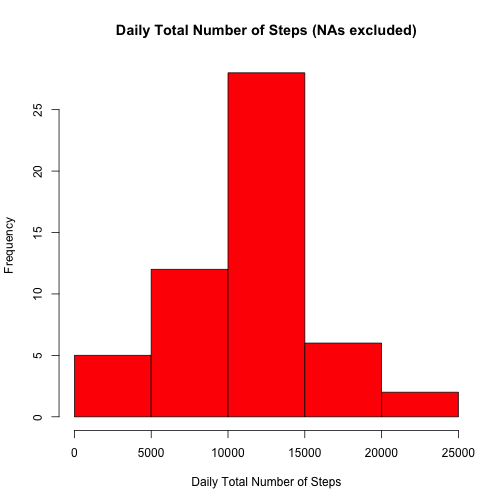
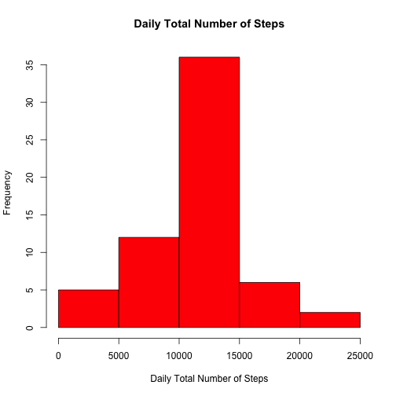

Reproducible Research: Peer Assessment 1
========================================

## Loading and preprocessing the data
First, lets load the activity data required for this assignment/analysis. The data is located in our current working directory. We will also preview the loaded data to get a sense of its content


```r
activityFileName <- "activity.csv"
activityData <- read.csv(activityFileName, header=TRUE)
head(activityData)
```

```
##   steps       date interval
## 1    NA 2012-10-01        0
## 2    NA 2012-10-01        5
## 3    NA 2012-10-01       10
## 4    NA 2012-10-01       15
## 5    NA 2012-10-01       20
## 6    NA 2012-10-01       25
```

```r
summary(activityData)
```

```
##      steps               date          interval   
##  Min.   :  0.0   2012-10-01:  288   Min.   :   0  
##  1st Qu.:  0.0   2012-10-02:  288   1st Qu.: 589  
##  Median :  0.0   2012-10-03:  288   Median :1178  
##  Mean   : 37.4   2012-10-04:  288   Mean   :1178  
##  3rd Qu.: 12.0   2012-10-05:  288   3rd Qu.:1766  
##  Max.   :806.0   2012-10-06:  288   Max.   :2355  
##  NA's   :2304    (Other)   :15840
```

## What is mean total number of steps taken per day?
Lets determine the mean and median total number of steps taken each day. Ignoring NA values, we will create a historgram to give us a visual representation, as well as directly calculate values for mean and median. We determine the mean to be 10766 and median to be 10765


```r
dailyStepsTotal <- aggregate(steps ~ date, data=activityData, FUN="sum", na.rm=TRUE)
x <- dailyStepsTotal$steps
hist(x, col="red", main="Daily Total Number of Steps (NAs excluded)", xlab="Daily Total Number of Steps")
```

 

```r
mean(x)
```

```
## [1] 10766
```

```r
median(x)
```

```
## [1] 10765
```

## What is the average daily activity pattern?
Let's create a time series plot of the 5-minute interval (x-axis) and the average number of steps taken, averaged across all days (y-axis).


```r
intervalStepsAvg <- aggregate(steps ~ interval, data=activityData, FUN="mean", na.rm=TRUE)
a <- intervalStepsAvg$interval
b <- intervalStepsAvg$steps
plot(a, b, type="l", xlab="5-minute Time Interval", ylab="Average Number of Steps")
```

 

Let's also determine which 5-minute interval, on average across all the days in the dataset, contains the maximum number of steps. We determine that to be the 835 interval, with an average of ~206 steps


```r
intervalStepsAvg[intervalStepsAvg$step==max(intervalStepsAvg$steps),]
```

```
##     interval steps
## 104      835 206.2
```

## Imputing missing values
Of the 17568 total rows/observations in the activity data, we determine the total number of rows missing values to be 2304


```r
nrow(activityData)-nrow(na.omit(activityData))
```

```
## [1] 2304
```

Our strategy for filling out missing values will be to use the 5-minute interval average across all days in the data set, previously computed and available in the intervalStepsAvg data frame.
We create a new dataset with the missing values filled in. We then create a historgram and calculate values for mean and median total steps taken per day using this new dataset. We determine the new mean to be 10766 and new median to be 10766. We see that the impact of imputing missing data is a slight change in the mediam value from 10765 to 10766. 


```r
activityData2 <- activityData
for(i in 1:nrow(activityData2)) {if(is.na(activityData2[i,1])){activityData2[i,1] <- intervalStepsAvg$steps[intervalStepsAvg$interval==activityData2[i,3]]}}
dailyStepsTotal2 <- aggregate(steps ~ date, data=activityData2, FUN="sum")
c <- dailyStepsTotal2$steps
hist(c, col="red", main="Daily Total Number of Steps", xlab="Daily Total Number of Steps")
```

 

```r
mean(c)
```

```
## [1] 10766
```

```r
median(c)
```

```
## [1] 10766
```

## Are there differences in activity patterns between weekdays and weekends?
Let's add a new factor variable called dayCategory in the dataset with two levels – “Weekday” and “Weekend” indicating whether a given date is a weekday or weekend day.


```r
activityData2$dayCategory <- ifelse(weekdays(as.Date(activityData2$date))=="Saturday","Weekend",ifelse(weekdays(as.Date(activityData2$date))=="Sunday","Weekend","Weekday"))
```

We then create a panel plot containing a time series plot of the 5-minute interval (x-axis) and the average number of steps taken, averaged across all weekday days or weekend days (y-axis). From the results, we see a difference in activity patterns between weekdays and weekends.


```r
intervalStepsAvg2 <- aggregate(steps ~ interval+dayCategory, data=activityData2, FUN="mean", na.rm=TRUE)
head(intervalStepsAvg2)
```

```
##   interval dayCategory   steps
## 1        0     Weekday 2.25115
## 2        5     Weekday 0.44528
## 3       10     Weekday 0.17317
## 4       15     Weekday 0.19790
## 5       20     Weekday 0.09895
## 6       25     Weekday 1.59036
```

```r
d <- intervalStepsAvg2[intervalStepsAvg2$dayCategory=="Weekday",1]
e <- intervalStepsAvg2[intervalStepsAvg2$dayCategory=="Weekday",3]
f <- intervalStepsAvg2[intervalStepsAvg2$dayCategory=="Weekend",1]
g <- intervalStepsAvg2[intervalStepsAvg2$dayCategory=="Weekend",3]

par(mfcol=c(2,1))
plot(d, e, type="l", xlab="5-minute Time Interval", ylab="Average Number of Steps", ylim=c(0,max(e,g)), main="Weekday")
plot(f, g, type="l", xlab="5-minute Time Interval", ylab="Average Number of Steps", ylim=c(0,max(e,g)), main="Weekend")
```

 
